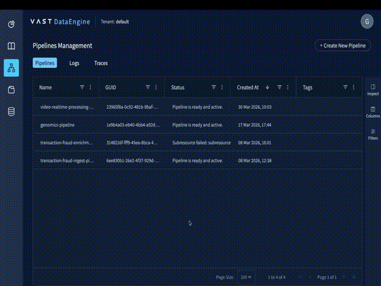
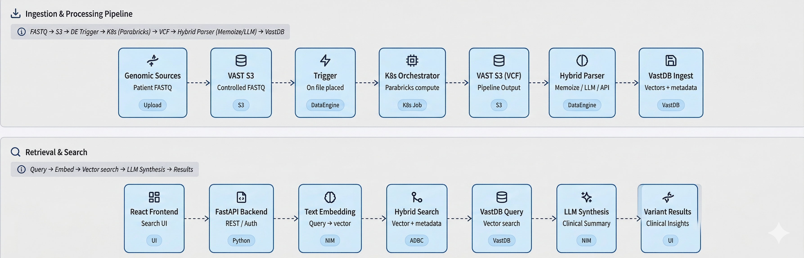

# VAST DataEngine — Genomic RAG Engine Foundation Stack

An end-to-end Genomic Pipeline and Clinical Search system powered by [VAST DataEngine](https://www.vastdata.com/platform/dataengine), [NVIDIA Parabricks](https://www.nvidia.com/en-us/clara/genomics/), and NVIDIA NIMs — turning raw sequencing reads into AI-powered clinical insights on a single unified platform.

This Blueprint demonstrates the full VAST AI OS stack for healthcare and life sciences: event-driven serverless genomics pipelines, VastDB hybrid structured + vector storage, and RAG-powered semantic search — with no data movement, no separate vector database, and no manual orchestration.

---

## Table of Contents

- [Overview](#overview)
- [Deployment](#deployment)
- [Pipeline](#pipeline)
- [RAG Features](#rag-features)
- [Why VAST](#why-vast)
- [Component Documentation](#component-documentation)
- [Need Help](#need-help)

---

## Demo

[](https://drive.google.com/file/d/1XvCPpWRZEqDRX9U_C7Ft_6WeFH4ZFEfm/view?usp=sharing)

---

## Overview

Two integrated systems working together:

| System | Description |
|---|---|
| **K8s Application** | React web UI + FastAPI REST API — patient registration, pipeline dashboard with inline DAG and logs, semantic search, drug discovery via NVIDIA BioNeMo |
| **DataEngine Ingest Pipeline** | Serverless event-driven VCF processing, ClinVar enrichment, LLM annotation, and NVIDIA NIM vector embedding |



---

## Deployment

| Component | Guide |
|---|---|
| **K8s Application** (React UI, FastAPI backend, K8s Jobs) | [K8s Application Guide](deployments/genomics-k8s-application/README.md) |
| **DataEngine Ingest Pipeline** (fastq-registrar, vcf-parser, variant-processor) | [DataEngine Pipeline Guide](deployments/dataengine-genomics-pipeline/README.md) |

### Quick Start

See the deployment guides above for full step-by-step instructions.

**1. Deploy the K8s Application:**

```bash
cp deployments/genomics-k8s-application/values-template.yaml \
   deployments/genomics-k8s-application/values.yaml
# Edit values.yaml — fill in credentials and endpoints

helm upgrade --install genomic-engine ./deployments/genomics-k8s-application \
  --namespace genomics --create-namespace \
  -f deployments/genomics-k8s-application/values.yaml
```

**2. Deploy the Ingest Pipeline:**

```bash
cp deployments/dataengine-genomics-pipeline/genomics-ingest-template.yaml \
   deployments/dataengine-genomics-pipeline/genomics-ingest.yaml
# Edit genomics-ingest.yaml — fill in credentials, then upload as a DataEngine secret in the UI
```

**3. Register a patient and run the pipeline:**

Open the UI → **Register Sample** → click **Fill Mock Data** → **Register and Start Pipeline**.
The pipeline runs automatically — no manual steps required.

---

## Pipeline

The pipeline follows an **event-driven serverless architecture** where each stage automatically triggers the next, requiring zero manual intervention after the initial patient registration.

```
┌─────────────────────────────────────────────────────────────────────────┐
│                        VAST Genomic Pipeline                             │
├─────────────────────────────────────────────────────────────────────────┤
│                                                                          │
│  [1] Patient Registration          [2] FASTQ Lands in S3                │
│  ┌──────────────────────┐          ┌──────────────────────┐             │
│  │  React UI + FastAPI  │ ───────► │  genomics-fastq-     │             │
│  │  Backend             │  S3 Copy │  files bucket        │             │
│  └──────────────────────┘          └──────────┬───────────┘             │
│                                               │ S3 Event                │
│                                               ▼                         │
│  [3] DataEngine Trigger            [4] K8s Job Compute                  │
│  ┌──────────────────────┐          ┌──────────────────────┐             │
│  │  genomics-fastq-     │ ───────► │  Parabricks / Mock   │             │
│  │  registrar           │  Submit  │  (GPU or CPU)        │             │
│  └──────────────────────┘          └──────────┬───────────┘             │
│                                               │ Upload VCF              │
│                                               ▼                         │
│  [5] VCF Parsing + Enrichment      [6] Embedding Generation             │
│  ┌──────────────────────┐          ┌──────────────────────┐             │
│  │  genomics-vcf-parser │          │  genomics-variant-   │             │
│  │  ClinVar + LLM       │ ───────► │  processor           │             │
│  │  Summaries           │  Chain   │  NVIDIA NIM (2048d)  │             │
│  └──────────────────────┘          └──────────┬───────────┘             │
│                                               │                         │
│                                               ▼                         │
│  [7] VastDB Vector Store                                                │
│  ┌─────────────────────────────────────────────────────────┐            │
│  │              VastDB `variants` Table                     │            │
│  │  ┌──────────┬─────────────┬──────────────┬───────────┐  │            │
│  │  │ Gene     │ Clinical    │ LLM Summary  │ Embedding │  │            │
│  │  │ Info     │ Significance│ Text         │ Vector    │  │            │
│  │  └──────────┴─────────────┴──────────────┴───────────┘  │            │
│  └─────────────────────────────────────────────────────────┘            │
│                              ▼                                           │
│  [8] RAG-Powered Clinical Search                                         │
│  ┌─────────────────────────────────────────────────────────┐            │
│  │    Semantic Search → Clinical Ranking → LLM Synthesis   │            │
│  └─────────────────────────────────────────────────────────┘            │
│                                                                          │
└─────────────────────────────────────────────────────────────────────────┘
```

### Stage Breakdown

| Stage | Component | What happens |
|---|---|---|
| 1 | UI + Backend | Clinician registers patient demographics and FASTQ source path |
| 2 | Backend | Validates source file, upserts patient in VastDB, registers sample, copies FASTQ |
| 3 | DataEngine | S3 event on `genomics-fastq-files` triggers `genomics-fastq-registrar` |
| 4 | fastq-registrar | Submits K8s Job (mock or GPU mode), updates sample status → `processing` |
| 5 | K8s Job | Three init-container sequence: download FASTQ → Parabricks/Mock → upload VCF |
| 6 | DataEngine | S3 event on `genomics-vcf-outputs` triggers `genomics-vcf-parser` |
| 7 | vcf-parser | Parses variants, enriches with ClinVar annotations, generates LLM summaries |
| 8 | variant-processor | Embeds variant descriptions via NVIDIA NIM, bulk-inserts into VastDB `variants` |
| 9 | Backend | Sample status → `completed`; variants available for semantic search |

### Compute Modes

| Mode | Container | Purpose |
|---|---|---|
| **Mock** (default) | `vastdatasolutions/genomic-engine-mock-parabricks` | CPU-only, generates deterministic synthetic VCFs — no GPUs required |
| **GPU** | `nvcr.io/nvidia/clara/clara-parabricks:4.7.0-1` | Production-grade variant calling with full GPU acceleration |

Switch between modes via `processing_mode` in `deployments/genomics-k8s-application/values.yaml`.
See [GPU Mode](deployments/genomics-k8s-application/README.md#gpu-mode-real-parabricks) for full setup.

---

## RAG Features

The RAG system transforms raw genomic data into actionable clinical insights by combining VastDB vector search with LLM synthesis. Once a sample reaches `completed` status, the full feature set is available.

| Feature | Description | Benefit |
|---|---|---|
| **Semantic Variant Search** | Natural language queries across all variant embeddings via `array_cosine_distance` (ADBC, server-side) | Ask "breast cancer risk variants" instead of writing complex queries |
| **Clinical Significance Ranking** | Pathogenic → Likely Pathogenic → Drug Response → VUS → Benign automatic prioritization | Critical findings surface first in every search result |
| **ClinVar Integration** | Automatic NIH ClinVar enrichment for every variant during VCF parsing | Validated expert interpretations attached to each variant at ingest time |
| **LLM Variant Explanations** | AI-generated plain-language summaries via NVIDIA Llama 3.1 Nemotron 70B | Complex genetic notation translated for clinicians and non-specialists |
| **Personalized Clinical Insights** | Patient demographics (age, sex, ethnicity, BMI, notes) inform LLM synthesis | Recommendations consider individual context, not just the variant alone |
| **Drug Discovery (BioNeMo + DiffDock)** | Full pipeline: PubChem SMILES lookup → NVIDIA MolMIM molecule generation → RCSB PDB structure search → NVIDIA DiffDock protein-ligand docking | Novel candidate therapeutics generated and docked against real protein structures; all results cached in VastDB |
| **Patient-Filtered Search** | Scoped semantic queries to a specific patient's variant set | Focused pre-appointment review and treatment planning |
| **Variant Similarity** | Embedding-based cosine similarity across the full patient cohort | Identify variant patterns, research candidates, and rare variant clusters |
| **Hybrid Memoization** | ClinVar lookups and LLM summaries cached in VastDB per variant ID | Significant API cost savings when multiple patients share common variants |

### Clinical Significance Priority Order

Results from every search are re-ranked by this priority before being returned:

| Priority | Classification |
|---|---|
| 1 — highest | Pathogenic |
| 2 | Likely Pathogenic |
| 3 | Drug Response / Risk Factor |
| 4 | Conflicting Interpretations |
| 5 | Uncertain Significance |
| 6 | Unknown |
| 7 | Likely Benign |
| 8 — lowest | Benign |

---

## Component Documentation

| Component | Description |
|---|---|
| [backend](source-code/application/backend) | FastAPI REST API: patient/sample CRUD, K8s Job orchestration, VSS search via ADBC `array_cosine_distance`, LLM synthesis, BioNeMo MolMIM integration |
| [frontend](source-code/application/frontend) | React 18 UI with dark theme: pipeline dashboard with inline DAG and logs, semantic search, patient view, sample registration with mock auto-fill |
| [fastq-registrar](source-code/ingest/fastq-registrar) | DataEngine function: triggered on FASTQ file creation in S3; submits K8s Job via backend API, updates sample status |
| [vcf-parser](source-code/ingest/vcf-parser) | DataEngine function: parses VCF, extracts variants with INFO fields, ClinVar enrichment, LLM summaries, memoization cache |
| [variant-processor](source-code/ingest/variant-processor) | DataEngine function: generates NVIDIA NIM embeddings, bulk-inserts variant records with vectors into VastDB |
| [mock-parabricks](source-code/application/backend/mock/parabricks) | CPU-only Parabricks substitute: generates deterministic synthetic VCFs for demo and CI without GPUs |

### Key Files

| File | Purpose |
|---|---|
| [`deployments/genomics-k8s-application/values-template.yaml`](deployments/genomics-k8s-application/values-template.yaml) | Configuration template — credentials, endpoints, compute mode, NIM settings |
| [`deployments/dataengine-genomics-pipeline/genomics-ingest-template.yaml`](deployments/dataengine-genomics-pipeline/genomics-ingest-template.yaml) | DataEngine secret template for all three ingest functions |

---

## Need Help

- **K8s deployment:** [K8s Application Guide](deployments/genomics-k8s-application/README.md)
- **DataEngine pipeline:** [DataEngine Pipeline Guide](deployments/dataengine-genomics-pipeline/README.md)
- **GPU / real Parabricks:** [GPU Mode](deployments/genomics-k8s-application/README.md#gpu-mode-real-parabricks)
- **Troubleshooting:** [K8s Troubleshooting](deployments/genomics-k8s-application/README.md#troubleshooting)
- **Community:** [VAST Community Forums](https://community.vastdata.com/)
